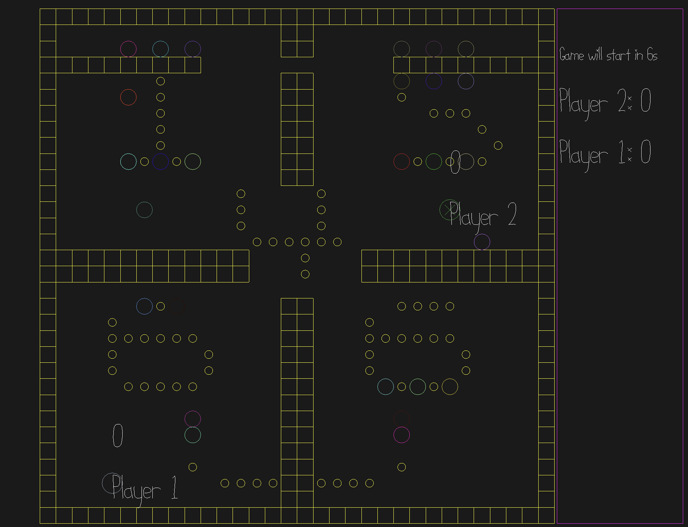

# Pac Man but you might get eaten by other Pac Man

Author: Junrui Zhao, Sizhe Chen

Design: Predator vs prey, try to eat consumables and get as much points as the prey. When you are the predator, try to catch other
players for points.     

Networking: 
The network structure is similar to the base code. We also include score/player_mode... information into the message so PlayMode can render
the corresponding component.

Screen Shot:

How To Play:

WASD to move your character.

Sources: Base code characters

Extra feature：introducing skills! You can use space to do use your skill if you picked it up somehwere in the areana!

This game was built with [NEST](NEST.md).

